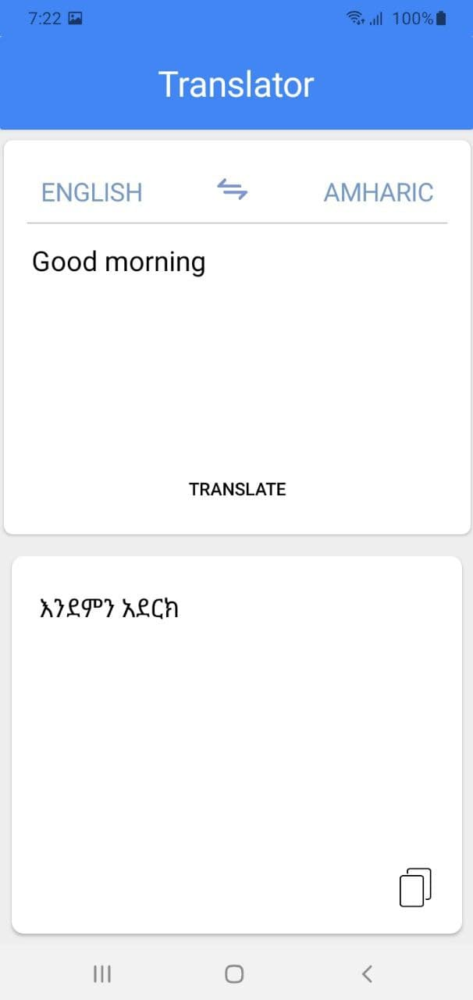
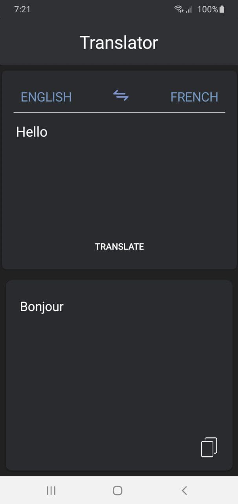
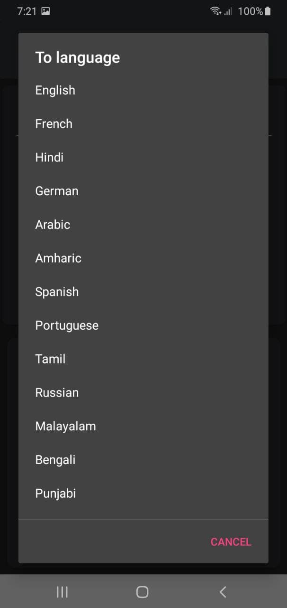

# Translator
 

 
 

Translator is a translator app. For the translator to work, I created a python api server that uses googletrans python module to translate words
and hosted it on heroku. Then, in the app we are accessing the api server.
 
 

# Appearance
<b>

 
    
    
    

 

# Features
1. You can translate around 15 languages.
2. It can detect your phones Theme mode.
3. You can copy the word you translated.

# Release

To download the app checkout the  playstore link that is https://play.google.com/store/apps/details?id=com.abdesol.translator

# Contribution

I am welcome to anyone who wants to add some features or make a different version of this app :)
